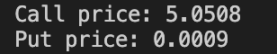
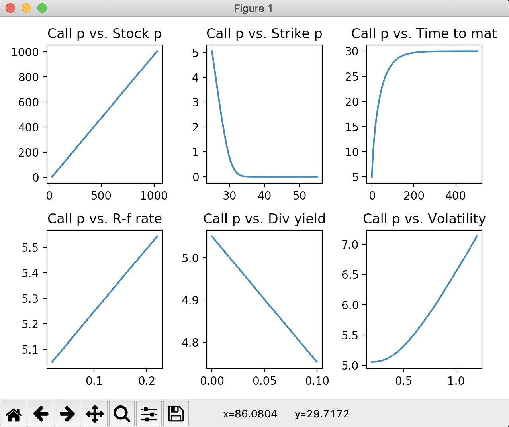
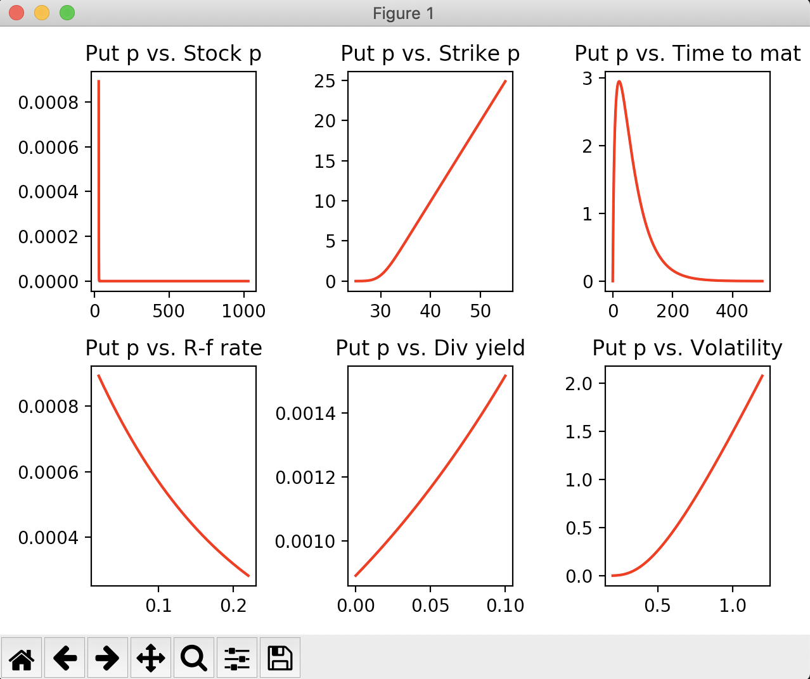

# BlackScholes101

Black-Scholes option pricing model to price european call and european put.

Plot change in option price with respect to change in parameter (partial change).

[Ex]. Output using script1.py

Enjoy!
